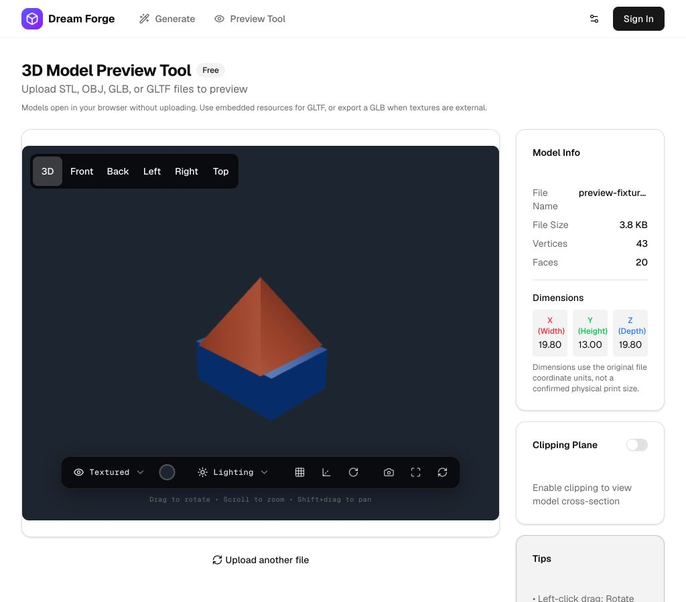
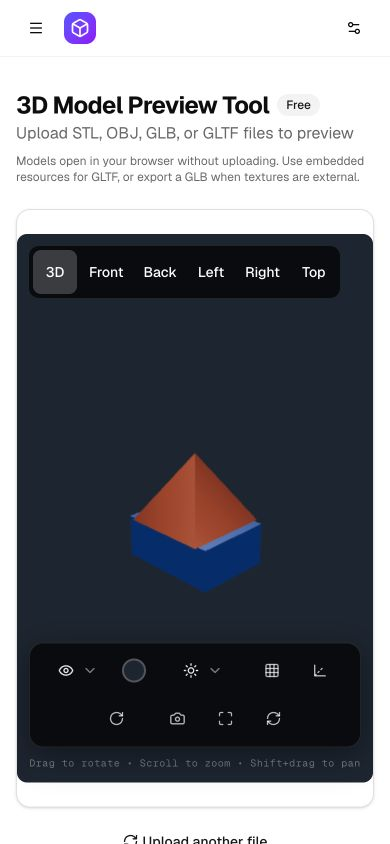

# 第一輪生成與預覽優化：驗證紀錄

日期：2026-09-05。以下是本機最終版本的檢查，沒有部署、付費生成、列印打樣或真實下單。

## 自動化檢查

| 指令（各目錄內） | 結果 | 證據範圍 |
| --- | --- | --- |
| `app: npm test` | 20／20 通過 | 實際 hook/callback 的錯誤恢復與 timeout；風格重新分析的成功／失敗阻擋；ReactDOM render 的歷史點數；Three.js 場景、相機、切面與材質 |
| `app: npm run lint` | 通過 | 全 app ESLint，包含新增測試 |
| `app: npm run build` | 通過 | TypeScript 及 32 個靜態頁面的正式建置 |
| `functions: npm test` | 16／16 通過 | 實際源碼＋mock provider/Firestore：模型、色盤、hint、top 扣款前攔截、單圖修正並發／過期回應、退款；Sharp 實際原生像素裁切 |
| `functions: npm run build` | 通過 | TypeScript 編譯，並更新 repo 追蹤的 `functions/lib` |
| `git diff --check` | 通過 | 變更空白格式 |

測試不增加依賴。前端 hook host 用於單元狀態轉移，不模擬 React concurrent scheduling；Firestore mock 不等於 emulator 或正式帳務。原生 TS 測試有 module-type 提示，Next build 有 Node deprecation 提示，皆未造成失敗。

## 瀏覽器驗證

透過 in-app browser，使用本機 STL、複合 GLB、含內嵌 PNG 貼圖的 GLB 及損毀 GLB，沒有使用用戶作品或遠端生成。

- 繁中 dev 版：GLB 載入、俯視切換、重設相機後模型保留；線框、切面開關／反向；無效 GLB 顯示錯誤後可載入 STL；STL 有立體光照。
- 正式靜態建置：英文 GLB 載入及同檔重新選取；內嵌貼圖實際顯示，灰模模式可隱藏表面顏色以檢查幾何。
- 桌面 1024×900 與手機 390×844：六個視角按鈕及工具列可見；手機 `scrollWidth = clientWidth = 390`。這是 viewport 模擬，不是實體手機觸控／效能測試。
- 下列兩張為正式建置的實際畫面；模型是測試幾何，不代表任何生成模型的效果。

### 桌面

### 手機

## 尚未驗證及後續門檻

- 未用真實帳戶呼叫 Gemini stable、任何 3D provider 或 Firestore emulator；官方型號／價格研究不能證明帳戶配額、畫質、延遲或實際帳單。
- 已登入的完整生成 UI（包含新增原圖／四視圖對照視窗）尚未做真實生成端到端驗證；本次用源碼測試覆蓋風格／點數的關鍵 callback。
- 未完成實體 iOS／Android 觸控、全螢幕、下載截圖、快速切換大模型、GLTF 外部資源及複合 OBJ 的完整瀏覽器回歸。
- 退款交易本身不可用時，保留已扣款及進行中狀態，避免誤稱已退；仍需後台對帳／恢復流程。沒有回填歷史失敗紀錄。
- 現有 3D 預設與歡迎點數不變；加值與列印付款仍關閉。後續依[迭代驗收計畫](../plans/2026-09-05-generation-to-order-iterations.md)進行模型實測、成本校正與結帳重建。
